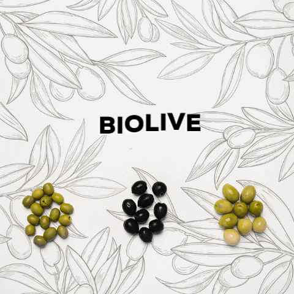

# Biolive 
 
 

> Feel free to make changes.

---

  

**Biolive** is a demo android app that allow olive press to send a request to **Biolive company** asking to get rid of the rest of rubbish.

**Biolive** allows you to :

* Send a request to the nearest Biolive company
* Calculte the rubbish weight
* Checking buyers
* Checking Sellers
* Checking products

## Author and contributors
[*Mohamed Jawadi*](https://facebook.com/0xmohamed) (*Designer*)

[*Yessine Kchaou*](https://www.facebook.com/nisay.james) (*Developer*)

[*karim Safagine*](https://www.facebook.com/karim.safagine) (*Developer*)

## Contributing

#### Fix/Edit Content

If you see an error or a place where content should be updated or improved, just fork this repository to your account, make the change you'd like and then submit a pull request. If you're not able to make the change, file an [issue](https://github.com/0xCTF/Biolive/issues).

## LICENSE
> © [MIT](https://github.com/0xCTF/Biolive/blob/master/LICENSE) | 2020, 0xCTF/Biolive

